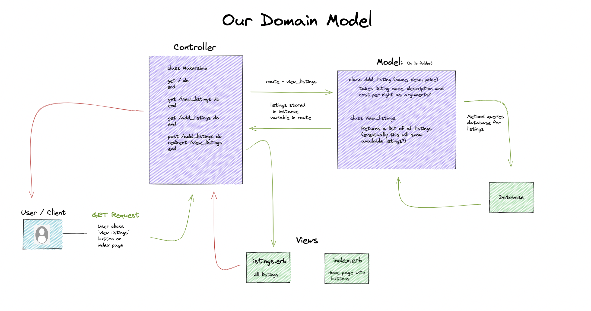

## Domain Model  

## To setup the main database:

* Connect to psql
* Create the database using the psql command `CREATE DATABASE makersbnb;`
* Connect to the database using the psql command `\c makersbnb`;
* Run this query CREATE TABLE listings(id SERIAL PRIMARY KEY, name VARCHAR(250), description VARCHAR(1000), price VARCHAR(10));
* Populate your table with a row by running `INSERT INTO listings (name, description, price) values ('waterfront mansion', 'spacious place by the sea', 500);`

## Setup the main test database:

* Connect to psql
* Create the database using the psql command `CREATE DATABASE makersbnb_test;`
* Connect to the database using the psql command `\c makersbnb_test`;
* Run this query CREATE TABLE listings(id SERIAL PRIMARY KEY, name VARCHAR(250), description VARCHAR(1000), price VARCHAR(10));
* Populate your table with a row by running `INSERT INTO listings (name, description, price) values ('waterfront mansion', 'spacious place by the sea', 500);`

## Create Users Table in both DBs
* `bundle exec rake db:create_migration NAME=create_users` #you may not need to run this if migrate folder already exists with file inside
* `bundle exec rake db:migrate RACK_ENV=test`
* `bundle exec rake db:migrate RACK_ENV=development` 

## How to create a new branch

`$ git switch -c joe-branch`

After changes, push to your branch:

 '$ git add .'  
 '$ git commit -m "amended README"'    
 `$ git push --set-upstream origin joe-branch' (only the first time you push otherwise it is   
 `$ git push`

 Then do a Pull request, set Reviewers for your PR and then Merge.

---

### Stories

### Viewing listings
  
  * As a user of MakersBnB

  * So that I can choose a place to stay

  * I'd like to see a list of all listings on the site

---

